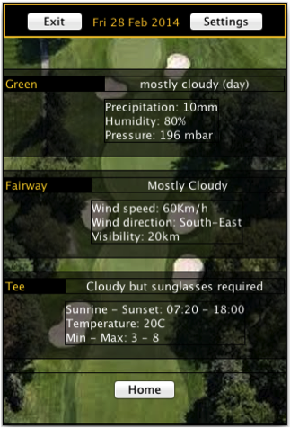
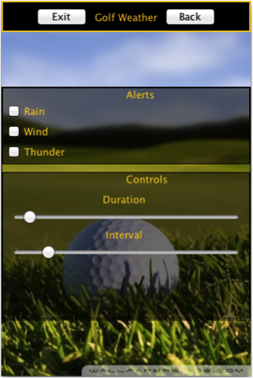

# golf-app-java
Weather app for golfers - Java and Java Swing

 

       
## How to run the code

From command line by launching from "code" folder the MAIN class "WeatherApp" in "bin" using all libraries in "lib"
E.g. on Mac: ` java -cp bin:lib/*:. WeatherApp `

The code requires Internet connection and assumes that the IP address of the launching machine can be resolved and that 
the name of the city retrieved from the IP address is spelled exactly in the same way by the Yahoo API. If this is not the case, 
the code will print in exception and the code has been set to default automatically to "London".

       
## What libraries are used

Class "IpInfoDbClient" requires the following external libraries:
 * commons-logging-1.1.3
 * httpcomponents-client-4.3.3
 * httpcomponents-core-4.3.2
 * jackson-annotations-2.1.0.jar
 * jackson-core-2.1.0.jar
 * jackson-databind-2.1.0.jar

Class "Sounds" requires the following external libraries:
 * beads.jar
 * jl1.0.1.jar
 * mp3spi1.9.4.jar
 * tritonus_share.jar

## What files/resources are used

Class "Sounds" requires the following audio files:
 * lightning.wav
 * rain.wav
 * wind.wav

Class "HomeScreen" requires the following image files:

 * golfLandscape2.jpg
 * button.jpg

 * iconThunder.jpg
 * iconRain.jpg
 * iconSnow.jpg
 * iconCloudy.jpg
 * iconSun.jpg
 * iconWind.jpg

 * goldBall1.jpg
 * goldBall2.jpg
 * goldBall3.jpg
 * goldBall4.jpg
 * goldBall5.jpg

Class "DayScreen" requires the following image files:
 * fairway3.jpg

Class "Settings" requires the following image files:
 * golfLandscape3.jpg
